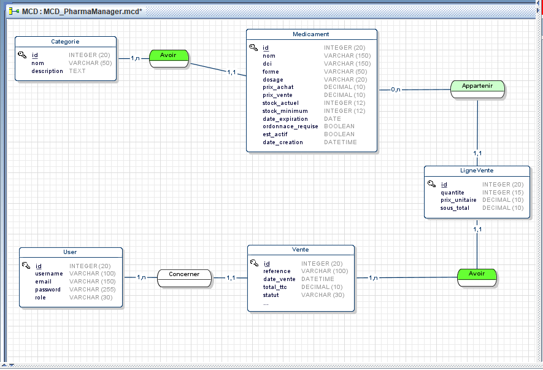
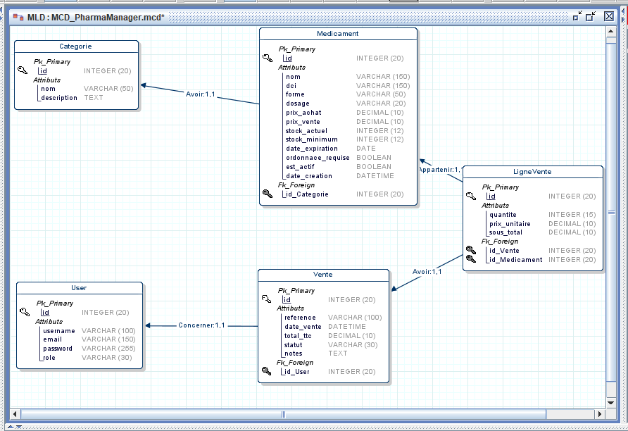
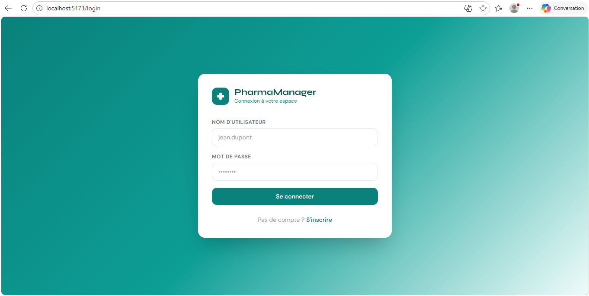

# PharmaManager — Pharmacy Management System

Professional full-stack pharmacy management system developed as part of the SMARTHOLOL technical assessment.

## Tech Stack

### Backend

* Python
* Django REST Framework
* PostgreSQL
* JWT Authentication
* Swagger / drf-spectacular

### Frontend

* React.js (Vite)
* JavaScript
* Axios
* TailwindCSS
* React Router

### DevOps

* Docker & Docker Compose
* GitHub Actions (CI/CD)

---

# Project Structure

```bash
pharma-manager/
│
├── pharma_backend/
│   ├── apps/
│   ├── config/
|   ├── core/
│   ├── requirements.txt
│   └── README.md
│
├── pharma_frontend/
│   ├── src/
│   ├── package.json
│   └── README.md
│
├── docker-compose.yml
└── README.md
```

---

# Features

* JWT Authentication
* Role-based access
* Medication management
* Stock alerts
* Sales management
* Dashboard analytics
* Soft delete
* Swagger API documentation
* Dockerized environment

---

# UML & Database Design

## MCD



## MLD



---

# Application Preview



---

# Run with Docker

```bash
docker compose up --build
```

### Services

| Service     | URL                                          |
| ----------- | -------------------------------------------- |
| Frontend    | http://localhost                             |
| Backend API | http://localhost:8000                        |
| Swagger     | http://localhost:8000/api/schema/swagger-ui/ |

---

# Run Locally

## Backend

```bash
cd pharma_backend
python -m venv venv

# Windows
. venv/Scripts/activate

pip install -r requirements.txt

python manage.py migrate
python manage.py runserver
```

## Frontend

```bash
cd pharma_frontend

npm install
npm run dev
```

---

# Documentation

* Backend documentation: [pharma_backend/README.md](./pharma_backend/README.md)
* Frontend documentation: [pharma_frontend/README.md](./pharma_frontend/README.md)

---

## 👨‍💻 Author

**Soufiane ZEKAOUI**
- GitHub: [@soufianezekaoui](https://github.com/soufianezekaoui)
- LinkedIn: [Soufiane Zekaoui](https://linkedin.com/in/soufiane-zekaoui-445b1b352/)
- Portfolio: [My_Personal_Website.com](https://soufianezekaoui.github.io/my_soufianeze_portfolio/)

Built for the SMARTHOLOL for technical assessment

<div align="center">

### ⭐ Star this repo if you found it helpful!

**Made with ❤️ and Python**

</div>
